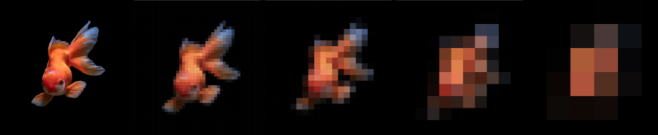

# pixelate


```sh
require('pixelate.js');

#path to a file (jpg, jpeg, gif, png supported)
const imageFile = './path/to/my/image.jpg';

#path to a folder
const dataDir = './output/destination';

#the factor by which to reduce the size of the photo before sampling (higher number -> faster processing; fewer samples)
const sizeReduce = 5;

#the final output will contain one sample set per value in the pps (pixels-per-sample) array (higher pps -> faster processing; fewer samples)
const pps = [1,2,3,5,10];

pixelate(imageFile, dataDir, sizeReduce, pps);
```

